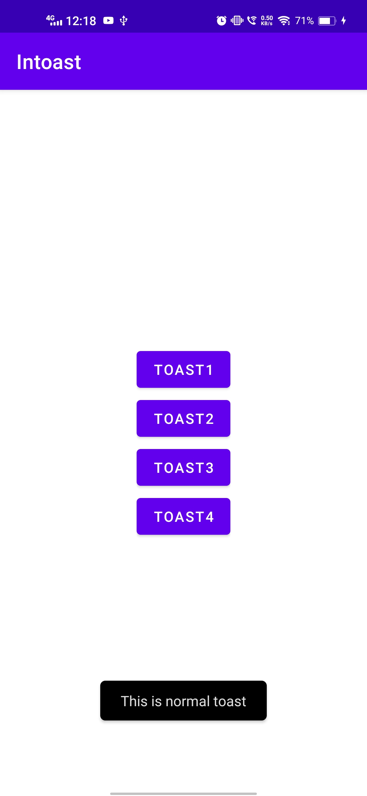
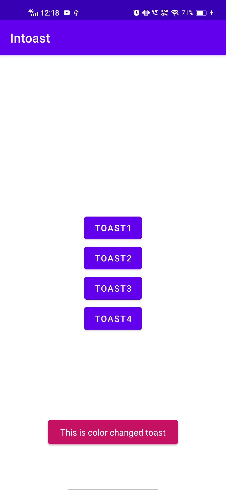
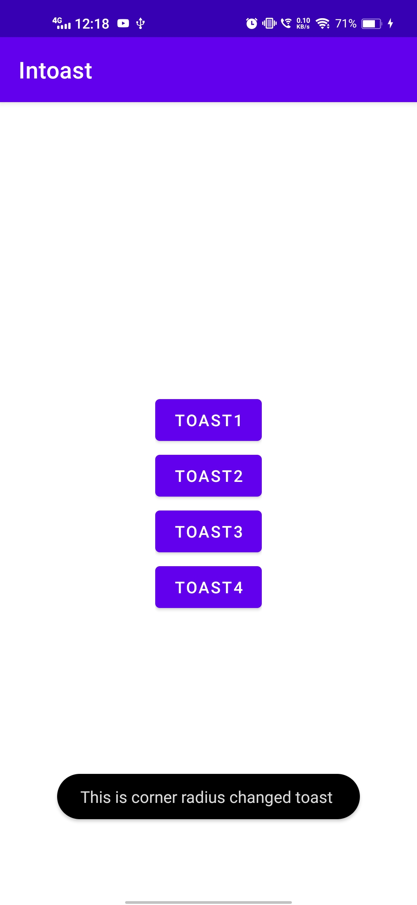
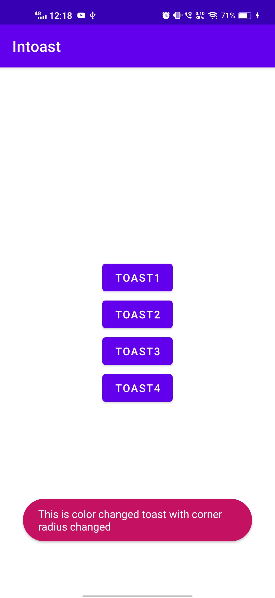

# Instagram Toastify Android❤
**A simple customizable toast for android developers.**

*Key Features:*

🚀 Easy Integration: Seamlessly integrate Instagram-style toasts into your web app with just a few lines of code.

🎨 Customizable: Customize the appearance, animations, and behavior of toasts to match your project's branding and style.

⏱️ Timed or Manual Control: Display toasts for a specific duration or allow users to dismiss them manually.

📸 Rich Content: Embed images, icons, and interactive elements within your toasts for informative and engaging notifications.

🔄 Callbacks: Implement callback functions to handle user interactions or toast lifecycle events.

🌐 Cross-browser Compatibility: Works smoothly on all modern browsers, ensuring a consistent user experience.

📦 Lightweight: Keep your web app fast and responsive with minimal library overhead.

# Preview🎉

      

# Configure your project
**Step 1 :**
Add it in your root build.gradle at the end of repositories:

    allprojects {
		repositories {
			...
			maven { url 'https://jitpack.io' }
		}
	}

**Step 2 :**
Add the dependency
 
	dependencies {
	        implementation 'com.github.rahul7400:InToast:latest-release'
	}

# Kotlin

**Normal/Default Toast**

    InToast.makeText(this,"This is normal toast",Toast.LENGTH_SHORT)

**Background and text color changing toast**

    val backgroundColor = "#C51162"    //string
    val textColor = "#ffffff"          //string
    
    InToast.makeText(this,"This is color changed toast",textColor ,backgroundColor,Toast.LENGTH_SHORT)

**Corner Radius Changing toast**

    val radius = 100f   //double
    InToast.makeText(this,"This is corner radius changed toast ",radius,Toast.LENGTH_SHORT)

**Both Color Changing and radius changing toast**

    val radius = 100f                  //double
    val backgroundColor = "#C51162"    //string
    val textColor = "#ffffff"          //string
    
    InToast.makeText(this,"This is color changed toast with corner radius changed",textColor ,backgroundColor ,radius,Toast.LENGTH_SHORT)

# Java

**Normal/Default Toast**

    InToast.makeText(this,"This is normal toast",Toast.LENGTH_SHORT);

**Background and text color changing toast**

    String backgroundColor = "#C51162";    //string
    String textColor = "#ffffff";         //string
    
    InToast.makeText(this,"This is color changed toast",textColor ,backgroundColor,Toast.LENGTH_SHORT);

**Corner Radius Changing toast**

    double radius = 100f;   //double
    InToast.makeText(this,"This is corner radius changed toast ",radius,Toast.LENGTH_SHORT);

**Both Color Changing and radius changing toast**

    double radius = 100f ;                 //double
    String backgroundColor = "#C51162";    //string
    String textColor = "#ffffff";          //string
    
    InToast.makeText(this,"This is color changed toast with corner radius changed",textColor ,backgroundColor ,radius,Toast.LENGTH_SHORT);
    
    
# License
Licensed under the [Apache Licence 2.0](LICENSE).
